# OJ

Just an exercise to learn more about Java SE & EE.

- OS: Windows 10 64-bit
- Platforms: MySQL 5.7, Docker Toolbox
- Image: Ubuntu 14.04 LTS with gcc, g++, jdk 1.8
- Other: dos2unix on Windows

## Part of Snapshots
### Main Page
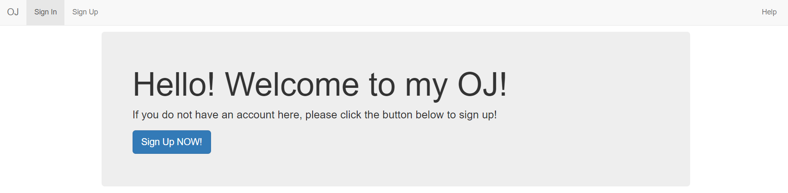

### Register
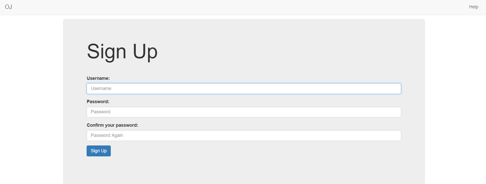

### Login
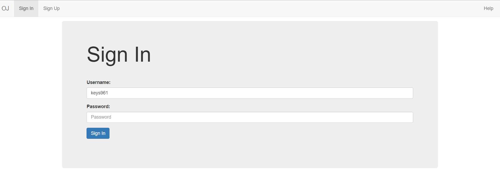

### User Main Page
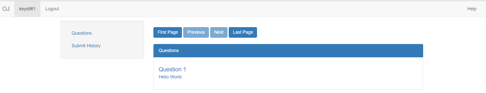

### Summary Page
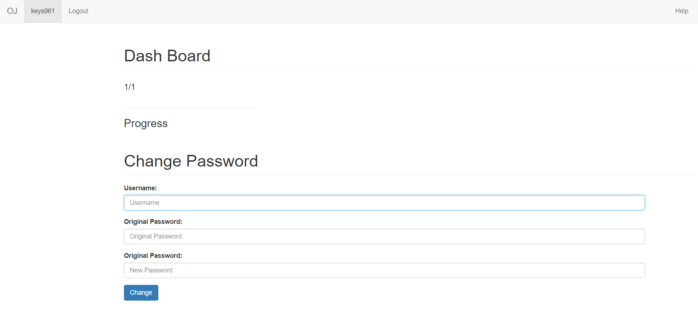

### Submit History
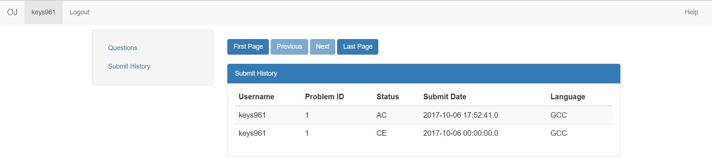

### Page for Answer Questions
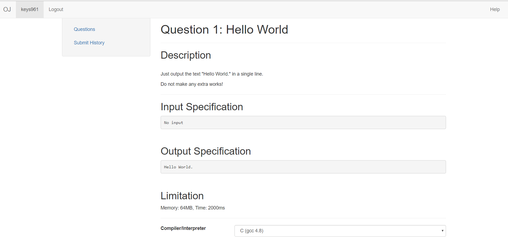

### Answer Sheet
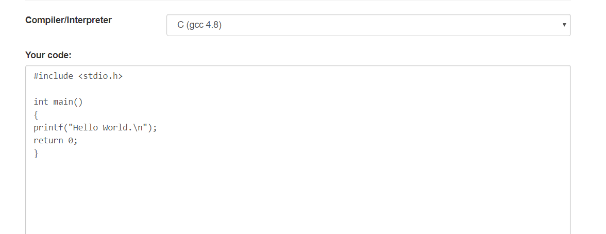

### Showing of Submit Status
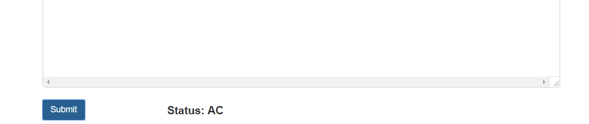

### Help Page
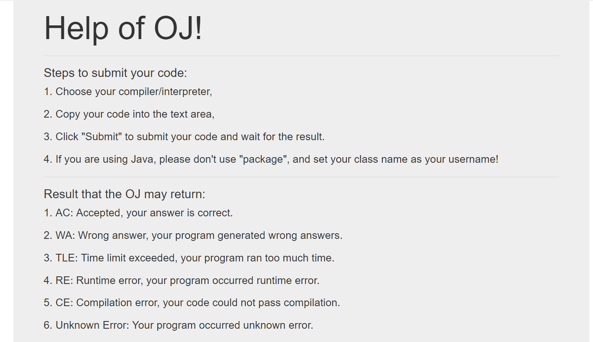

### Adding Problem for Admin
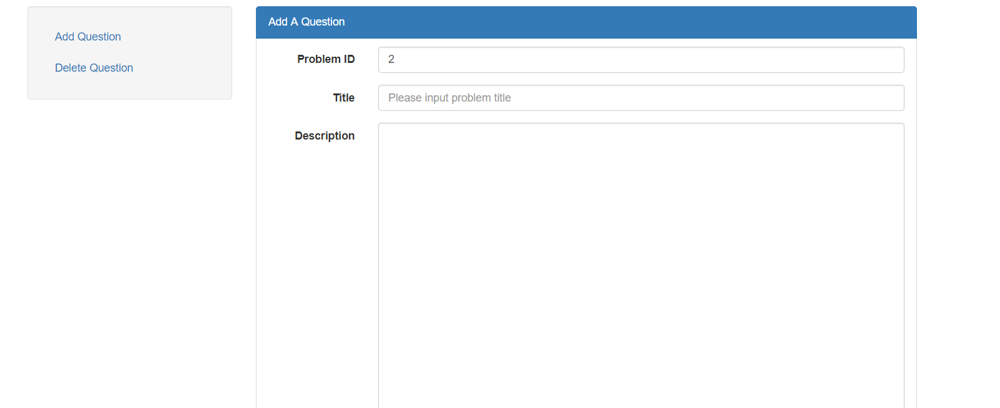

### Delete Problem for Admin
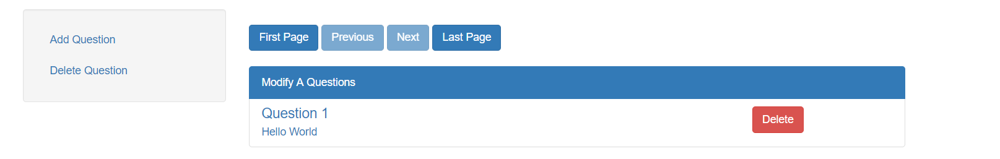
